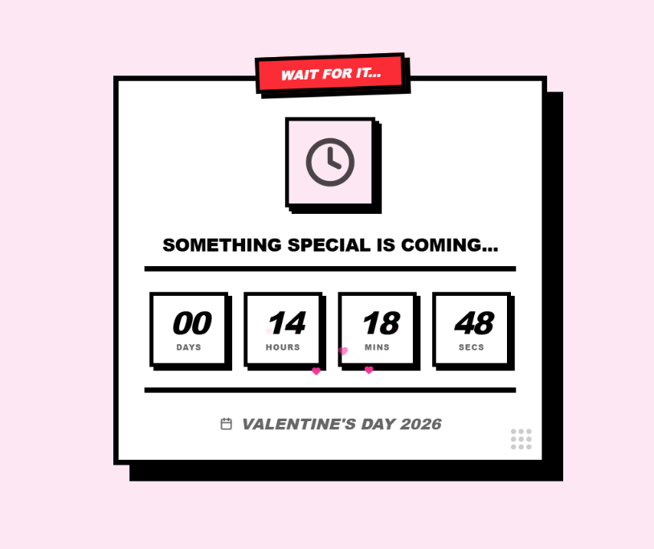
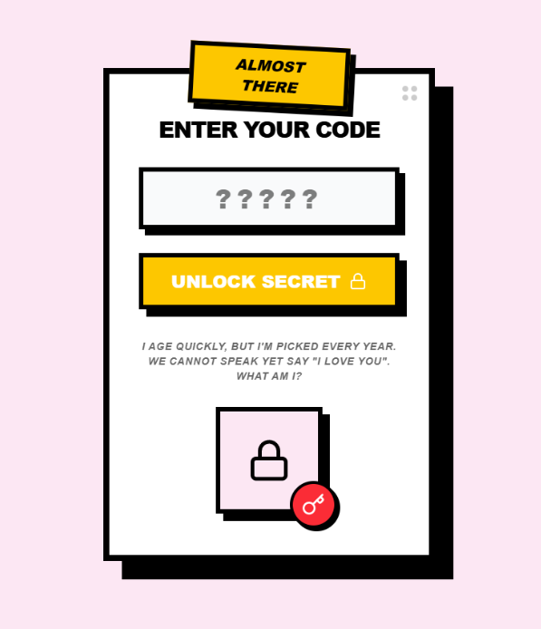
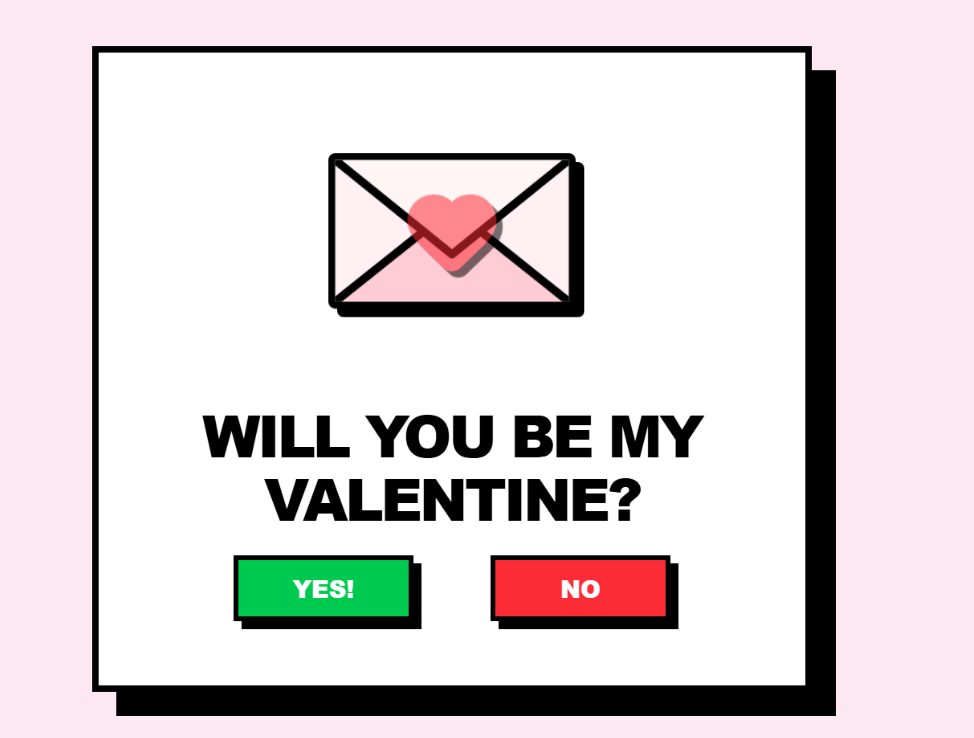

# 💝 Digital Valentine's Project

A customizable, interactive Valentine's Day web experience designed to "WOW" your partner. Featuring a time-gated countdown, a secret riddle lock, a playful "chase" question, and a personalized celebration dashboard.

## Features & Preview

| **The Countdown** | **The Secret Lock** | **The Big Question** |
|:---:|:---:|:---:|
|  |  |  |
| *Anticipation builds as the clock ticks down.* | *A personalized riddle keeps things a secret.* | *A playful, interactive "Yes/No" challenge.* |

---

## Quick Start

1. **Clone the repo**
2. **Install dependencies:** `npm install`
3. **Configure your content:** 
   - Copy `.env.example` to `.env`
   - Fill in your personal messages, secret code, and special dates.
4. **Run locally:** `npm run dev`
5. **Build for production:** `npm run build`

## Customization Guide

All personal content can be managed via the `.env` file without touching the code:

- **Pronouns:** Set `VITE_PRONOUN` (e.g., "He", "She", "They") to update the success message.
- **Secret Code:** Set `VITE_LOCK_CODE` (any length) and a matching `VITE_LOCK_HINT`.
- **Countdown:** Set `VITE_UNLOCK_DATE` (YYYY-MM-DD) to ensure it opens exactly when you want.
- **Memories:** Add image URLs or local paths to `VITE_MEMORIES_IMAGES`.
- **Local Images:** Best practice is to drop images directly into the `/public` root folder and reference them as `/your-image.jpg` in the `.env` file.
- **Messages:** Update the titles and personal notes in the Dashboard.

## Packaging for Release

When sharing this project, you should:
1. **Add Sample Images:** Place `cover.jpg`, `memory1.jpg`, etc., in the `/public` folder.
2. **Setup .env.example:** Ensure it points to these filenames.
3. **Build:** Running `npm run build` will generate the production-ready `dist` folder.

## Giving a Preview (Without Spoilers)

1. **Screenshot the Lock Screen:** It looks great but keeps the contents a secret.
2. **Debug Mode:** You can bypass the countdown by adding `?debug=true` to the URL.
3. **Social Preview:** The project is set up with a clean aesthetic that works well for social sharing!

## Tech Stack
- React + Vite
- Tailwind CSS
- Framer Motion (Animations)
- Lucide React (Icons)
- Canvas Confetti

---
*Created with ❤️ for Valentine's Day*
